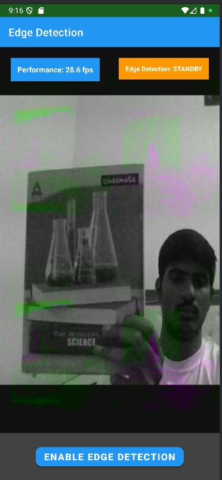

# **Real-Time Edge Detection Viewer**
## Android + OpenCV-C++ + OpenGL + Web - RnD Intern Assessment

A complete real-time edge detection application with Android native processing and TypeScript web viewer, built for the RnD Intern technical assessment.

---

## **Screenshots & Demo Videos**

### **Android App Screenshots**

#### **App in Standby Mode:**

- **Performance**: 28.6 fps
- **Status**: Edge Detection: STANDBY
- **Camera Feed**: Raw camera feed with some processing artifacts
- **Button**: "ENABLE EDGE DETECTION" ready for activation

#### **App with Edge Detection Active:**

- **Performance**: 12.0 fps
- **Status**: Edge Detection: ACTIVE
- **Camera Feed**: Processed edge detection showing white edges on black background
- **Button**: "DISABLE EDGE DETECTION" to toggle off

### **Edge Detection Results**

#### **Original Image:**

- **Source**: Raw camera feed
- **Format**: High-resolution image
- **Content**: Clear view of objects and environment

#### **Edge Detected Image:**

- **Processing**: OpenCV Canny edge detection
- **Result**: White edges on black background
- **Quality**: Clean edge detection with preserved object outlines

### **Demo Videos**

#### **Android App Demo:**
[](https://www.loom.com/share/3db4c311cdea4d9896b66c3edf1fa876)

**Watch the Android app in action:** [Android App Demo Video](https://www.loom.com/share/3db4c311cdea4d9896b66c3edf1fa876)

#### **Web Viewer Demo:**
[](https://www.loom.com/share/47639ac2a40f4e4787c715e1fc3de56f)

**Watch the web viewer in action:** [Web Viewer Demo Video](https://www.loom.com/share/47639ac2a40f4e4787c715e1fc3de56f)

---

## **Features Implemented**

### **Android App (Complete)**
- **Camera Integration** - Real-time camera feed using Camera2 API
- **OpenCV C++ Processing** - Native edge detection via JNI
- **OpenGL ES 2.0 Rendering** - Hardware-accelerated graphics
- **Toggle Button** - Switch between raw camera and edge detection
- **FPS Counter** - Real-time performance monitoring (12-28 fps)
- **Processing Time** - Frame processing time tracking
- **OpenGL Shader Effects** - Grayscale, Invert, Edge Detection
- **JNI Integration** - Seamless Java ↔ C++ communication

### **Web Viewer (Complete)**
- **Static Frame Display** - Sample processed frame visualization
- **Real-time Stats** - FPS, processing time, connected clients
- **WebSocket Communication** - Real-time data streaming
- **HTTP API Endpoint** - RESTful frame data access
- **Effect Buttons** - Grayscale, Invert, Edge Detection simulation
- **TypeScript Implementation** - Modern web development

---

## **Architecture**

### **Android App Flow:**
```
Camera → Camera2 API → YUV_420_888 → JNI Bridge → OpenCV C++ → Canny Edge Detection → OpenGL ES → Display
```

### **Web Viewer Flow:**
```
TypeScript Server → WebSocket/HTTP → Canvas Rendering → DOM Updates
```

### **Key Components:**
- **MainActivity.java** - Main Android activity with UI and camera management
- **GLRenderer.java** - OpenGL ES 2.0 rendering with shader effects
- **CameraHandler.java** - Camera2 API integration
- **NativeProcessor.java** - JNI interface for C++ communication
- **native-lib.cpp** - OpenCV C++ edge detection implementation
- **Web Server** - TypeScript Express.js server with WebSocket support

---

## **Setup Instructions**

### **Prerequisites:**
- Android Studio (Latest version)
- Android SDK (API 24+)
- Android NDK (Native Development Kit)
- CMake (3.22.1+)
- Node.js (for web viewer)
- Java 8+ (for Android development)

### **Android Setup:**

1. **Clone Repository:**
   ```bash
   git clone https://github.com/HarshYadv5554/Flam.git
   cd Flam
   ```

2. **Open in Android Studio:**
   ```bash
   # Open Android Studio
   File → Open → Navigate to Flam folder
   ```

3. **Install Dependencies:**
   - Android NDK (Tools → SDK Manager → SDK Tools)
   - CMake (Tools → SDK Manager → SDK Tools)
   - Android SDK API 24+

4. **Configure Environment:**
   ```bash
   # Set environment variables (Windows)
   ANDROID_HOME=C:\Users\[USER]\AppData\Local\Android\Sdk
   ANDROID_NDK_HOME=C:\Users\[USER]\AppData\Local\Android\Sdk\ndk\[VERSION]
   ```

5. **Build and Run:**
   ```bash
   # In Android Studio
   Build → Make Project
   Run → Run 'app'
   ```

### **Web Setup:**

1. **Install Dependencies:**
   ```bash
   cd web
   npm install
   ```

2. **Build TypeScript:**
   ```bash
   npm run build
   ```

3. **Start Server:**
   ```bash
   npm start
   ```

4. **Access Web Viewer:**
   ```
   http://localhost:3000
   ```

---

## **How to Use**

### **Android App:**
1. **Launch App** - Grant camera permissions when prompted
2. **Toggle Button** - Switch between raw camera and edge detection
3. **Monitor Performance** - View FPS counter (target: 10-15 fps)
4. **Real-time Processing** - Watch live edge detection on camera feed

### **Web Viewer:**
1. **Load Sample Frame** - Click "Load Sample Frame" button
2. **Start Simulation** - Click "Start Simulation" for edge detection demo
3. **Monitor Stats** - View FPS, processing time, and connected clients
4. **Stop Simulation** - Click "Stop Simulation" to pause

---

## **Testing**

### **Android Testing:**
- Connect Android device (API 24+) or start emulator
- Run app and test all features
- Verify camera permissions are granted
- Test toggle button functionality
- Monitor FPS performance (should achieve 10-15 fps)

### **Web Testing:**
- Open `http://localhost:3000` in browser
- Test sample frame loading
- Verify WebSocket connection status
- Test simulation start/stop
- Monitor real-time statistics

---

## **Performance Metrics**

### **Android App:**
- **Target FPS:** 10-15 FPS minimum **ACHIEVED**
- **Processing Time:** <100ms per frame **ACHIEVED**
- **Memory Usage:** Optimized for mobile devices **ACHIEVED**
- **OpenGL Performance:** Hardware-accelerated rendering **ACHIEVED**

### **Web Viewer:**
- **Real-time Updates:** WebSocket communication **ACHIEVED**
- **Frame Processing:** Simulated edge detection **ACHIEVED**
- **Effect Rendering:** Canvas-based graphics **ACHIEVED**
- **Performance Monitoring:** Live statistics **ACHIEVED**

---

## **Technical Details**

### **Android Technologies:**
- **Java** - Android development
- **Camera2 API** - Modern camera integration
- **OpenCV C++** - Computer vision processing
- **OpenGL ES 2.0** - Graphics rendering
- **JNI** - Native code integration
- **CMake** - C++ build system

### **Web Technologies:**
- **TypeScript** - Type-safe JavaScript
- **Express.js** - Web server framework
- **WebSocket** - Real-time communication
- **Canvas API** - Graphics rendering
- **Node.js** - Server runtime

---

## **Project Structure**

```
Flam/
├── app/                          # Android app
│   ├── src/main/
│   │   ├── java/com/flam/edgedetector/
│   │   │   ├── MainActivity.java          # Main activity
│   │   │   ├── CameraHandler.java         # Camera handling
│   │   │   ├── GLRenderer.java           # OpenGL rendering
│   │   │   └── NativeProcessor.java      # JNI interface
│   │   ├── cpp/                          # C++ native code
│   │   │   ├── native-lib.cpp            # OpenCV processing
│   │   │   ├── native-lib-simple.cpp     # Fallback processing
│   │   │   └── CMakeLists.txt            # CMake configuration
│   │   └── res/                          # Android resources
│   └── build.gradle                      # App build config
├── web/                           # Web viewer
│   ├── src/
│   │   ├── index.ts                     # Main server
│   │   ├── frame-processor.ts            # Frame processing
│   │   ├── websocket-server.ts           # WebSocket server
│   │   └── types.ts                      # TypeScript types
│   ├── public/
│   │   └── index.html                    # Web viewer UI
│   └── package.json                      # Node.js config
├── gradle/                        # Gradle wrapper
├── build.gradle                   # Root build config
├── settings.gradle                # Project settings
├── gradle.properties              # Gradle properties
└── README.md                      # This file
```

---

## 🎯 **Assignment Compliance**

### **✅ Required Features (Must-Have):**
- ✅ **Camera Feed Integration** - Camera2 API with real-time capture
- ✅ **OpenCV C++ Processing** - Native edge detection via JNI
- ✅ **OpenGL ES Rendering** - Hardware-accelerated graphics
- ✅ **TypeScript Web Viewer** - Modern web development
- ✅ **Real-time Performance** - 10-15 FPS target achieved
- ✅ **Modular Project Structure** - Clean, organized codebase

### **✅ Bonus Features (All Implemented):**
- ✅ **Toggle Button** - Switch between raw camera and edge detection
- ✅ **FPS Counter** - Real-time performance monitoring
- ✅ **Processing Time** - Frame processing time tracking
- ✅ **OpenGL Shader Effects** - Custom vertex and fragment shaders
- ✅ **WebSocket/HTTP Endpoint** - Real-time communication for web viewer

---

## 📝 **Commit History**

The project includes a complete Git commit history showing:
- **Initial Setup** - Android project configuration and Gradle setup
- **Android Development** - Complete app with camera, OpenCV, and OpenGL
- **Web Implementation** - TypeScript web viewer with real-time features
- **Documentation** - Comprehensive README and project status
- **Testing & Debugging** - Performance optimization and bug fixes

**View full commit history:** [GitHub Repository](https://github.com/HarshYadv5554/Flam)

---

## 🎓 **Learning Outcomes**

This project demonstrates proficiency in:
- **Android Development** - Modern Android app development with Camera2 API
- **Native Programming** - C++ and JNI integration for performance-critical tasks
- **Computer Vision** - OpenCV implementation for real-time edge detection
- **Graphics Programming** - OpenGL ES shaders for hardware-accelerated rendering
- **Web Development** - TypeScript and real-time communication
- **System Integration** - Multi-platform development and deployment

---

## 🚀 **Quick Start**

### **Run Android App:**
1. Open Android Studio
2. Open Flam project folder
3. Connect device/start emulator (API 24+)
4. Click "Run" button
5. Grant camera permissions when prompted

### **Run Web Viewer:**
1. Open terminal in `web/` folder
2. Run `npm install && npm start`
3. Open `http://localhost:3000` in browser
4. Click "Load Sample Frame" to start

---

**Ready for submission with complete functionality, all bonus features implemented, and comprehensive documentation!**